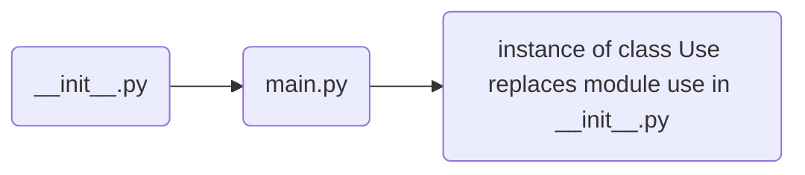
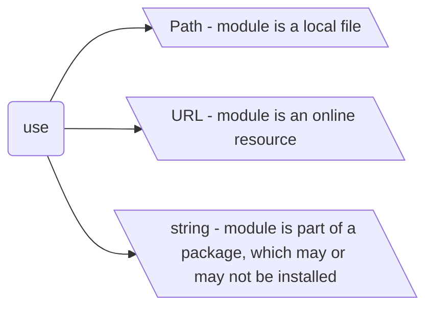
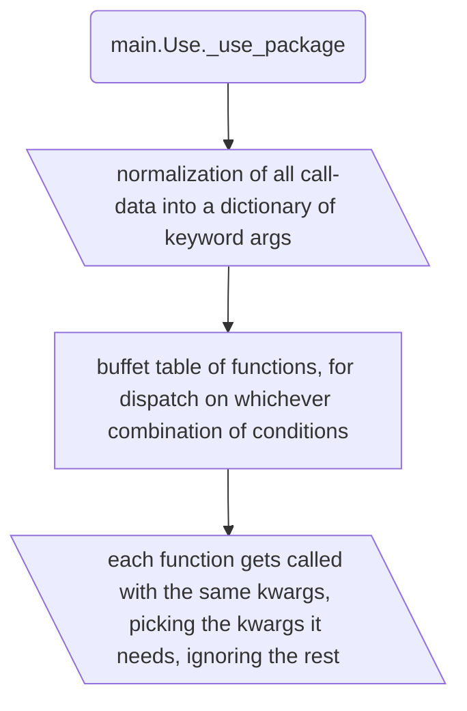
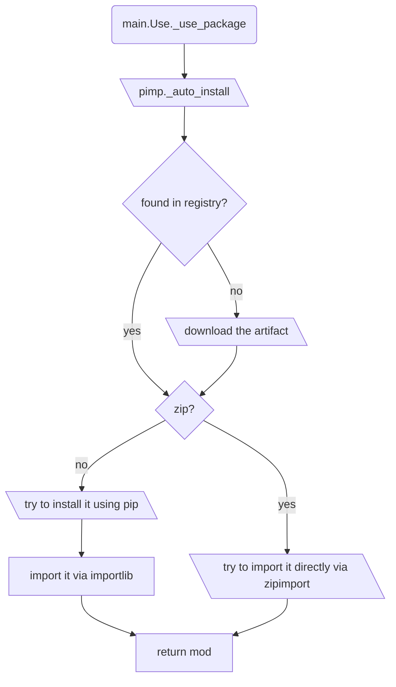

This is an overflow of how justuse works. This should give you an idea where to look for things. Don't rely on this document.

## Initialization

## Modes of operation

This is defined on the class Use via singledispatch on the type of argument

## use package
While using local or online resources as modules is very straight forward, using modules as part of packages is not.
To use a module from a package with auto-installation, you need to think of the name to be used as two-parted. The first part is how you would pip-install it, the second is how you would import the module. You can specify the name in three ways:

    # package name that you would pip install = "py.foo"
    # module name that you would import = "foo.bar"
    
    use("py.foo/foo.bar")
    use(("py.foo", "foo.bar"))
    use(package_name="py.foo", module_name="foo.bar")

However you call it, it all gets normalized into `name` (the single string representation), `package_name` for installation and `module_name` for import.

### auto-installation
Inline-installation of packages is one of the most interesting and complex features of justuse.

With version and hash properly defined and auto-installation requested, the flow of action is as following:

