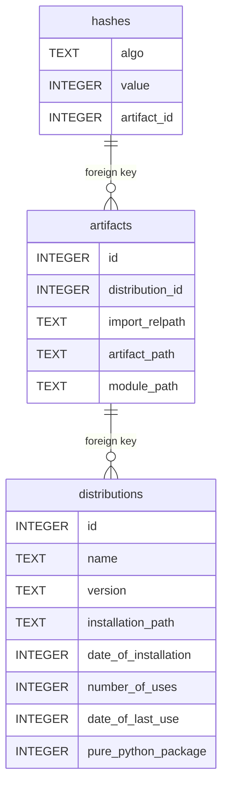

This is the schema of the registry database for reference.

* Packages have a name and version, but are released as platform-dependent (or independent, as pure-python) distributions.
* Each distribution corresponds to a single downloadable and installable file, called an artifact.
* Each artifact has hashes that are generated using certain algorithms, which map to a very large number (no matter how this number is represented otherwise - as hexdigest or JACK or something else).
* Once a distribution has been installed the artifact could be removed (since everything is now unpacked, compiled etc), but it also can be kept for further P2P sharing.
* The distribution is installed in a venv, isolated.

# use(URL)
In case of a single module being imported from a web-source, the module is cached in <home>/web-modules as a file with a 
random but valid module name. We keep track of the mapping via DB: artifact.artifact_path -> web-URI used to fetch the 
module, artifact.module_path -> module-file