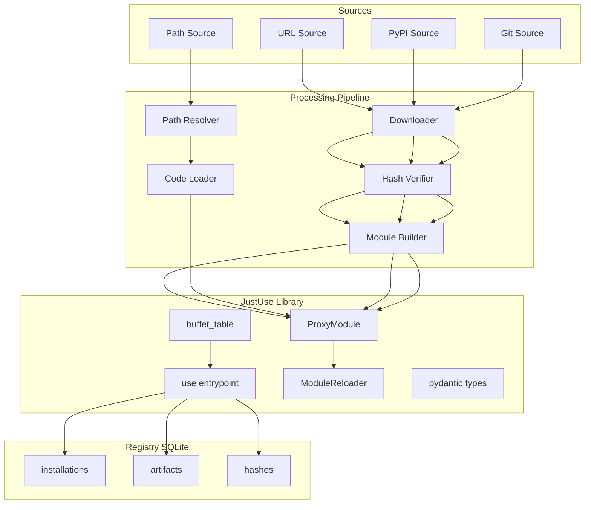
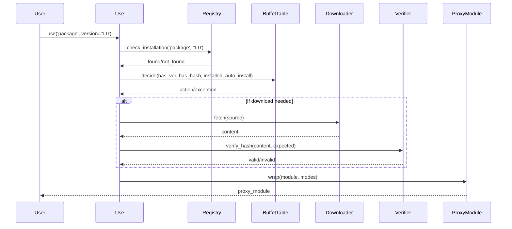
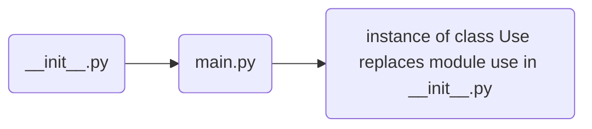
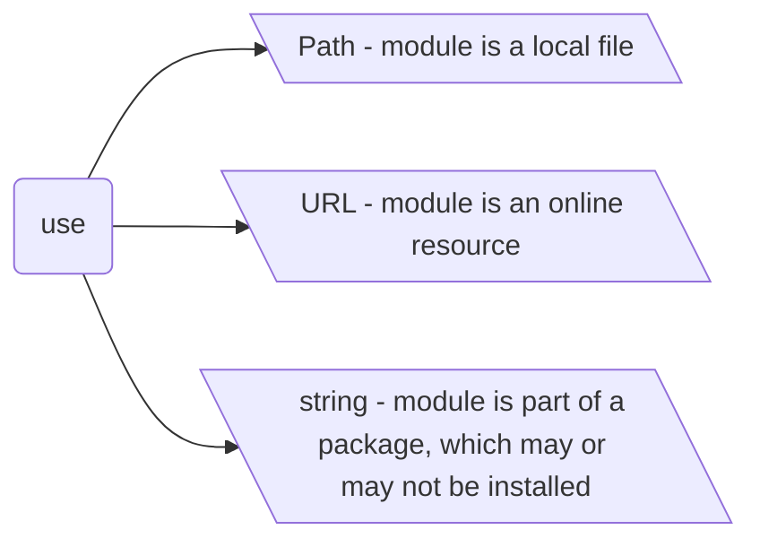
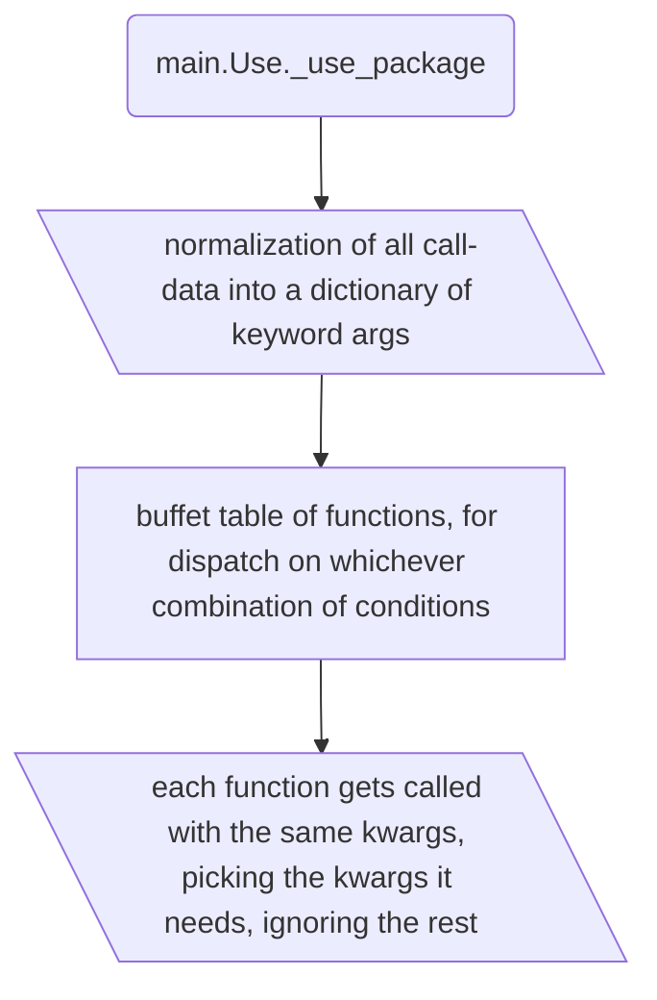
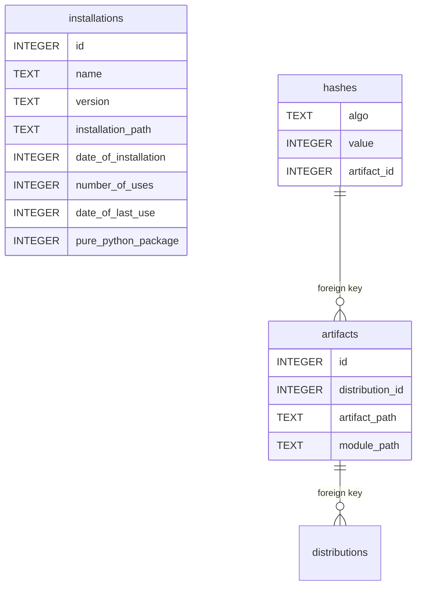

# Architecture

## 1. System Architecture

## 2. Core Components

| Component | Purpose | Key Features |
|-----------|---------|--------------|
| **use()** | Main dispatcher | Type-based routing, registry init, session management |
| **Registry** | SQLite metadata | Installations, artifacts, hashes, usage stats |
| **ProxyModule** | Module wrapper | Hot-reload, aspect application, interception |
| **ModuleReloader** | File monitoring | Threaded/async modes, signature checks |
| **buffet_table** | Decision logic | `(has_req_ver, has_hashes, installed, auto_install)` → Exception/Module |

### Registry Schema

| Table | Columns | Purpose |
|-------|---------|---------|
| **installations** | `id, name, version, path, install_date, uses, last_use, pure_python` | Package metadata |
| **artifacts** | `id, distribution_id, artifact_path, module_path` | File tracking |
| **hashes** | `algo, value, artifact_id` | Verification data |

### Dispatcher Routes

| Input Type | Route | Handler |
|------------|-------|---------|
| String | `pkg_name` → `_use_str` → `_use_package` | Package import |
| Tuple | `(pkg, mod)` → `_use_tuple` | Submodule import |
| URL | `URL` → `_use_url` | Remote download |
| Path | `pathlib.Path` → `_use_path` | Local file |
| git | `git` → `_use_git` | Repository clone |
| kwargs | `None + kwargs` → `_use_kwargs` | Keyword-based |

## 3. Core Workflows

### Workflow Details

| Workflow | Steps | Error Handling |
|----------|-------|----------------|
| **Import** | Source detect → Registry check → Buffet decision → Acquire → Install → Wrap → Register | Return default or raise ImportError |
| **Hot-Reload** | File watch → Change detect → Signature check → Reload → Error handling | Emit NotReloadableWarning |
| **Hash Verify** | Extract expected → Hash content → Compare → Proceed/fail | Raise SecurityError on mismatch |
| **Aspect Apply** | Pattern match → Decorate → Recurse → Register aspects | Track for reload compatibility |

### Hash Algorithms

| Algorithm | Use Case | Performance | Security |
|-----------|----------|-------------|----------|
| **SHA256** | Production | Medium | High |
| **BLAKE2s** | Development | High | High |
| **JACK** | Compact display | N/A | Same as source |

## Code Flow & Initialization

This section illustrates the initialization and main code flow of JustUse, including how arguments are dispatched and how auto-installation works.

### Initialization

### Modes of Operation

The `use` class dispatches on argument type:

### Package Use & Normalization

When using modules as part of packages, names are normalized for installation and import:

    # package name to pip install = "py.foo"
    # module name to import = "foo.bar"
    use("py.foo/foo.bar")
    use(("py.foo", "foo.bar"))
    use(package_name="py.foo", module_name="foo.bar")

All calls are normalized into `name`, `package_name`, and `module_name`.

---
# Features & Capabilities

| Category | Features |
|----------|----------|
| **Core** | Unified import API (`use()`), inline version checking, hash pinning & verification (SHA256/BLAKE2s/JACK), auto-installation (PyPI, conda, C-extensions), multi-version support, hot auto-reloading, initial module globals, aspect-oriented programming (recursive decoration), default fallbacks, ProxyModule abstraction, registry & audit (SQLite), modes & flags (auto_install, fastfail, fatal_exceptions, no_browser, etc.), no-browser mode |
| **Security** | HTTPS enforcement, audit logging, configurable security levels, no public installation mode, hash verification, signature compatibility (planned), isolation (planned), module-level variable guards (planned) |
| **Configuration** | Layered config: env vars, config file, runtime flags, per-import options; testing & debugging support |
| **Error Handling** | Hierarchical error types, recovery strategies (fallbacks, isolated envs, registry rebuild, revert on reload failure), warning escalation |
| **Observability** | Usage metrics, immutable audit logs, compliance support |
| **Testing & Quality** | Comprehensive test suite (unit, integration, security, performance), CI/CD integration, mock infrastructure |
| **Planned/Advanced** | Plugin/slot architecture, visual dependency graph, P2P sourcing, on-site compilation (Cython), sub-interpreter isolation, signature verification, module-level guards |

---

## Registry Database Schema

The registry database tracks all installations, artifacts, and hashes for security, audit, and P2P sharing.

* Packages have a name and version, but are released as platform-dependent (or independent, as pure-python) distributions.
* Each distribution corresponds to a single downloadable and installable file, called an artifact.
* Each artifact has hashes that are generated using certain algorithms, which map to a very large number (no matter how this number is represented otherwise - as hexdigest or JACK or something else).
* Once a distribution has been installed the artifact could be removed (since everything is now unpacked, compiled etc), but it also can be kept for further P2P sharing.
* The distribution is installed in a venv, isolated.

