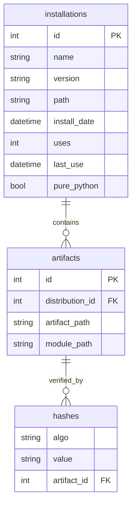
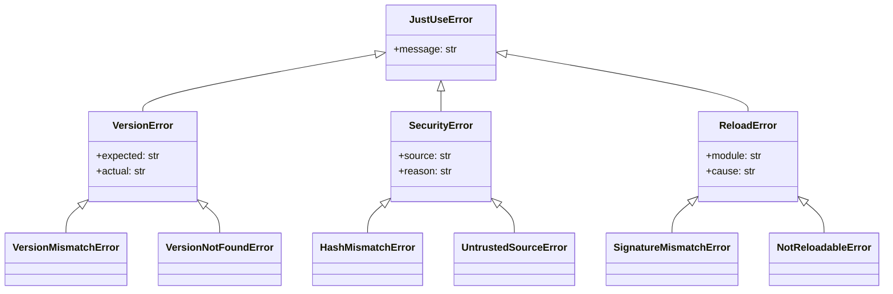
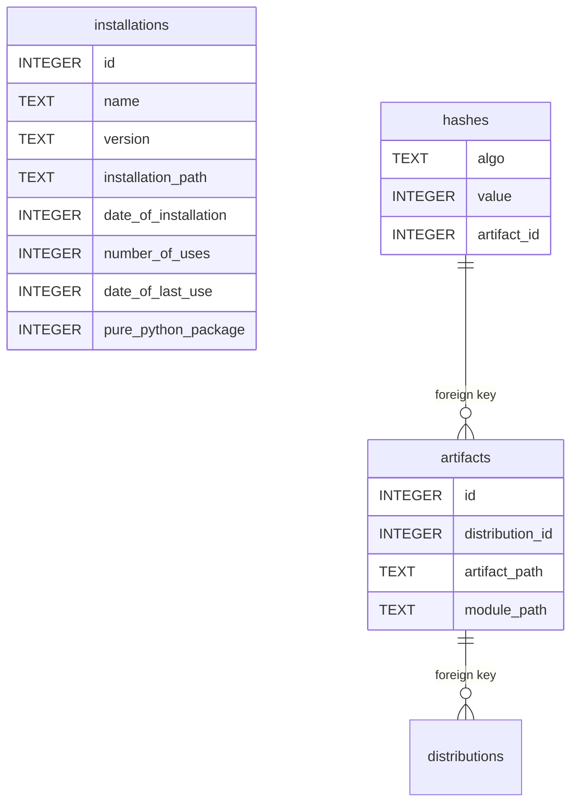
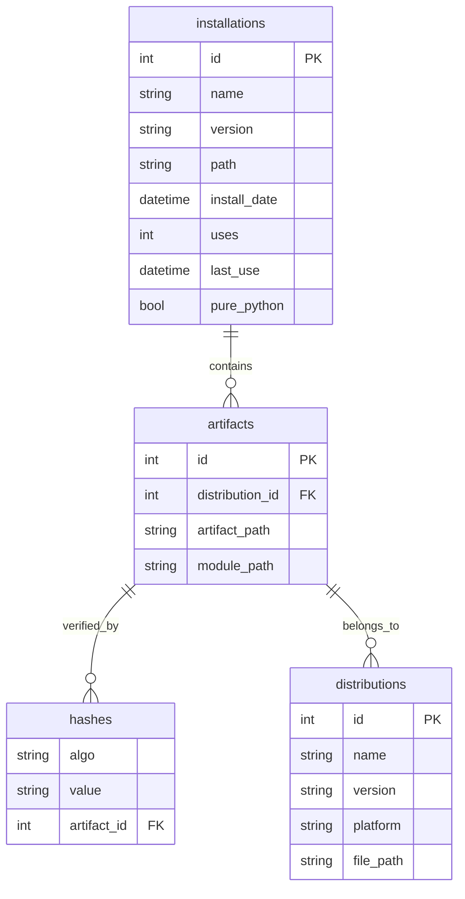

# Data Types and Structures

## 1. Core Data Types

### Enums & Flags

| Type | Values | Purpose |
|------|--------|---------|
| **Modes** | `auto_install`, `reloading`, `fastfail` | Behavior control |
| **Hash** | `SHA256`, `BLAKE2s`, `JACK` | Algorithm selection |
| **SourceType** | `URL`, `Path`, `git`, `string` | Import source types |

### Registry Schema



## 2. API Reference

### Core Import API

| Function | Parameters | Returns | Example |
|----------|------------|---------|---------|
| `use(pkg)` | package name, version, modes | Module | `use('numpy', version='1.21.0')` |
| `use(URL)` | url, hash_algo, hash_value | Module | `use(URL('http://...'), hash_algo=Hash.SHA256)` |
| `use(Path)` | path, modes, globals_dict | Module | `use(Path('mod.py'), modes=reloading)` |

### Source Types

```python
# String packages
use('numpy', version='1.21.0', modes=use.auto_install)

# URLs with verification
use(use.URL('https://example.com/mod.py'), hash_algo=use.Hash.SHA256, hash_value='abc...')

# Local paths with reloading
use(use.Path('my_module.py'), modes=use.reloading)

# Git repositories
use(use.git('https://github.com/user/repo.git', branch='main', subpath='src/mod.py'))

# Tuple imports
use(('package_name', 'submodule'))
```

### Configuration API

| Method | Purpose | Example |
|--------|---------|---------|
| `configure()` | Global settings | `use.configure(modes=use.auto_install, timeout=30)` |
| `context manager` | Temporary config | `with use.configure(modes=use.fastfail): ...` |

### Advanced Features

| Feature | Syntax | Purpose |
|---------|--------|---------|
| **Aspect decoration** | `mod @ (predicate, pattern, decorator)` | Apply decorators to callables |
| **Default fallback** | `use('pkg', default=use.SafeStub())` | Graceful degradation |
| **Global injection** | `use(use.Path('mod.py'), globals_dict={...})` | Resolve circular deps |
| **Registry ops** | `use.registry.list_installations()` | Metadata management |

### Error Handling



## 3. Registry Operations

| Operation | Method | Purpose |
|-----------|--------|---------|
| **List** | `registry.list_installations()` | Show all packages |
| **Stats** | `registry.get_usage_stats(pkg)` | Usage metrics |
| **Cleanup** | `registry.cleanup_old_versions()` | Remove old versions |
| **Backup** | `registry.backup(path)` | Create backup |
| **Rebuild** | `registry.recreate()` | Reconstruct from artifacts |


# Features & Capabilities

| Category | Features |
|----------|----------|
| **Core** | Unified import API (`use()`), inline version checking, hash pinning & verification (SHA256/BLAKE2s/JACK), auto-installation (PyPI, conda, C-extensions), multi-version support, hot auto-reloading, initial module globals, aspect-oriented programming (recursive decoration), default fallbacks, ProxyModule abstraction, registry & audit (SQLite), modes & flags (auto_install, fastfail, fatal_exceptions, no_browser, etc.), no-browser mode |
| **Security** | HTTPS enforcement, audit logging, configurable security levels, no public installation mode, hash verification, signature compatibility (planned), isolation (planned), module-level variable guards (planned) |
| **Configuration** | Layered config: env vars, config file, runtime flags, per-import options; testing & debugging support |
| **Error Handling** | Hierarchical error types, recovery strategies (fallbacks, isolated envs, registry rebuild, revert on reload failure), warning escalation |
| **Observability** | Usage metrics, immutable audit logs, compliance support |
| **Testing & Quality** | Comprehensive test suite (unit, integration, security, performance), CI/CD integration, mock infrastructure |
| **Planned/Advanced** | Plugin/slot architecture, visual dependency graph, P2P sourcing, on-site compilation (Cython), sub-interpreter isolation, signature verification, module-level guards |

---

## Use-Case Patterns

### use(Path)
Import a local file as a module.

### use(str)
Import a module by name from installed packages or trigger auto-installation.

### use(URL)
#### reckless
* Use a web-based module by URL, without hash pinning. Useful for internal testing, but unsafe for production.
* Content can change or be tampered with.

#### static
* Content is fixed by hash. URL is just a transport; hash ensures integrity.
* Downloaded content is stored as an artifact with a hash, compiled into another artifact (system-specific hash).

#### dynamic
* Content is dependent only on the URL and can change at any time.

### use(git)
* For content hosted on GitHub, GitLab, etc. Content is fixed by commit hash, making it auditable and reproducible. Useful for both development and production.


# Schema
This is the schema of the registry database for reference.

* Packages have a name and version, but are released as platform-dependent (or independent, as pure-python) distributions.
* Each distribution corresponds to a single downloadable and installable file, called an artifact.
* Each artifact has hashes that are generated using certain algorithms, which map to a very large number (no matter how this number is represented otherwise - as hexdigest or JACK or something else).
* Once a distribution has been installed the artifact could be removed (since everything is now unpacked, compiled etc), but it also can be kept for further P2P sharing.
* The distribution is installed in a venv, isolated.



> **Note:** All use-case patterns, narrative examples, and workflow descriptions have been moved to a dedicated document: `spec 04 - Workflows and Use Cases.md`. This file is now strictly authoritative for data types, schemas, and relationships.

## 4. UML Diagrams

### Registry Entity-Relationship (ER) Diagram



### Error Type Hierarchy


### JSON Error Envelope Schema

JustUse supports structured JSON error output for agent and LLM workflows. JSON diagnostics are emitted via a dedicated logger, and the logger's configuration determines the output destination (stdout, file, etc.).

- `error_id`: Unique error code (e.g., JU1003)
- `type`: Error class/type (e.g., HashMismatchError)
- `severity`: fatal, warning, info
- `message`: Human-readable summary
- `context`: Dict with error context (e.g., package, hashes, source)
- `recovery_actions`: List of suggested actions (commands, config patches, etc.)
- `error_namespace`: Error domain (e.g., JUSTUSE_SECURITY)
- `justuse_version`: Version string
- `timestamp`: ISO8601 timestamp

See `llms.md` for full schema, detection logic, and RFC 7807 compatibility.

## use(git)
For content hosted on github, gitlab etc. The content is fixed by the hash of the commit, so the content is always the same. This is useful for testing and development, but also for production, because the content is fixed and can be audited. The
