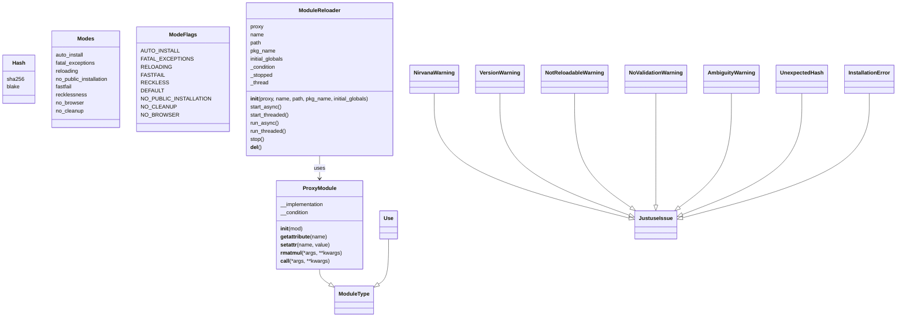
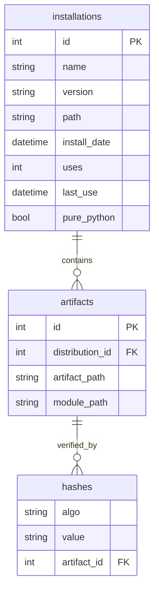
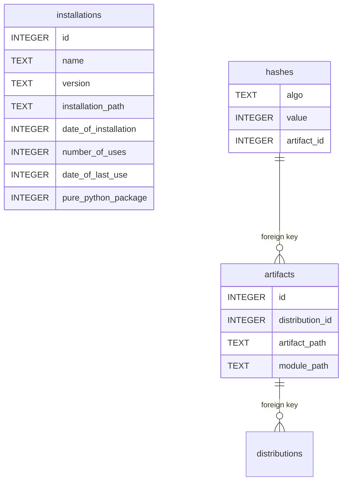
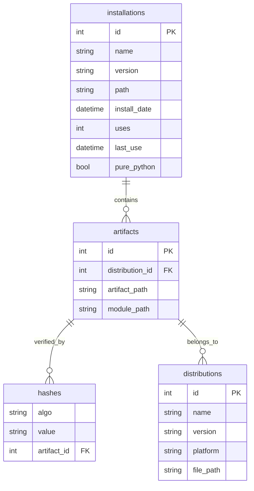
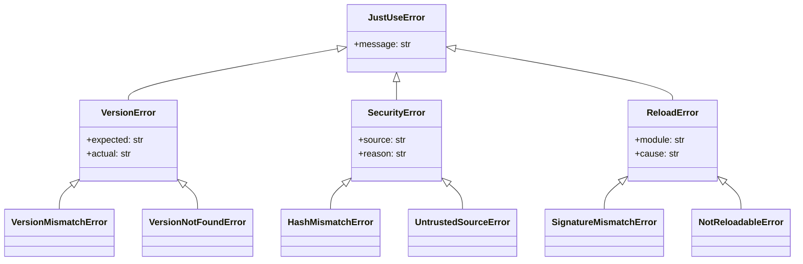

# Data Types and Structures

## 1. Core Data Types

#### Modes

| Mode                  | Purpose                                                        |
|-----------------------|----------------------------------------------------------------|
| auto_install          | Automatically install missing packages from PyPI/conda          |
| fatal_exceptions      | Raise exceptions instead of warnings for critical errors         |
| reloading             | Enable hot-reloading of modules on file change                 |
| no_public_installation| Disallow installation from public package indexes               |
| fastfail              | Fail immediately on error, no retries or fallbacks              |
| recklessness          | Allow unsafe operations (e.g., unverified URLs)                 |
| no_browser            | Disable browser-based install flows and prompts                 |
| no_cleanup            | Skip cleanup of temporary files and artifacts                   |

#### Classes and Types

### Registry Schema

## 3. Registry Operations

| Operation | Method | Purpose |
|-----------|--------|---------|
| **List** | `registry.list_installations()` | Show all packages |
| **Stats** | `registry.get_usage_stats(pkg)` | Usage metrics |
| **Cleanup** | `registry.cleanup_old_versions()` | Remove old versions |
| **Backup** | `registry.backup(path)` | Create backup |
| **Rebuild** | `registry.recreate()` | Reconstruct from artifacts |

# Features & Capabilities

# Schema
This is the schema of the registry database for reference.

* Packages have a name and version, but are released as platform-dependent (or independent, as pure-python) distributions.
* Each distribution corresponds to a single downloadable and installable file, called an artifact.
* Each artifact has hashes that are generated using certain algorithms, which map to a very large number (no matter how this number is represented otherwise - as hexdigest or JACK or something else).
* Once a distribution has been installed the artifact could be removed (since everything is now unpacked, compiled etc), but it also can be kept for further P2P sharing.
* The distribution is installed in a venv, isolated.

> **Note:** All use-case patterns, narrative examples, and workflow descriptions have been moved to a dedicated document: `spec 04 - Workflows and Use Cases.md`. This file is now strictly authoritative for data types, schemas, and relationships.

## 4. UML Diagrams

### Registry Entity-Relationship (ER) Diagram

### Error Type Hierarchy

### JSON Error Envelope Schema

JustUse supports structured JSON error output for agent and LLM workflows. JSON diagnostics are emitted via a dedicated logger, and the logger's configuration determines the output destination (stdout, file, etc.).

- `error_id`: Unique error code (e.g., JU1003)
- `type`: Error class/type (e.g., HashMismatchError)
- `severity`: fatal, warning, info
- `message`: Human-readable summary
- `context`: Dict with error context (e.g., package, hashes, source)
- `recovery_actions`: List of suggested actions (commands, config patches, etc.)
- `error_namespace`: Error domain (e.g., JUSTUSE_SECURITY)
- `justuse_version`: Version string
- `timestamp`: ISO8601 timestamp

See `llms.md` for full schema, detection logic, and RFC 7807 compatibility.

## use(git)
For content hosted on github, gitlab etc. The content is fixed by the hash of the commit, so the content is always the same. This is useful for testing and development, but also for production, because the content is fixed and can be audited. The
