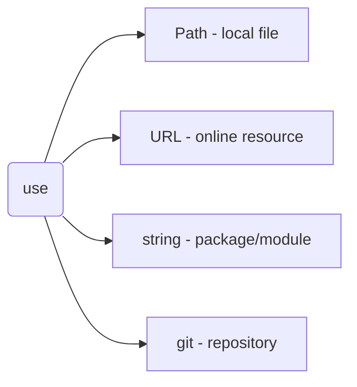
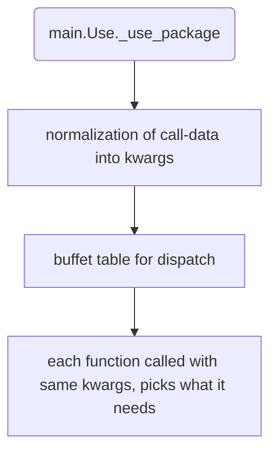
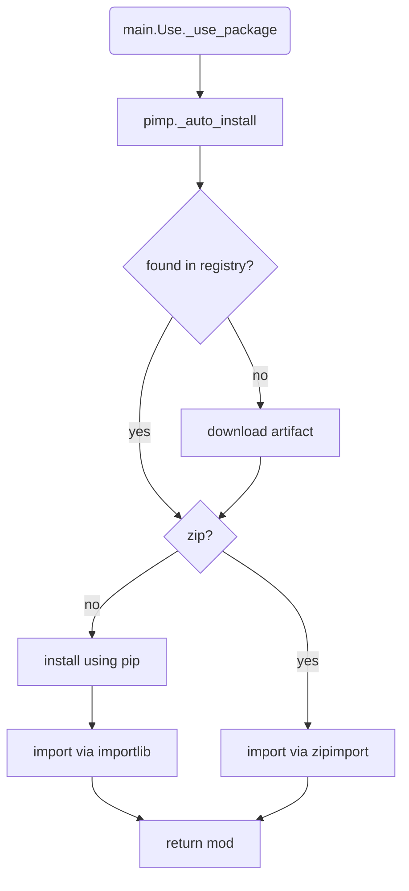
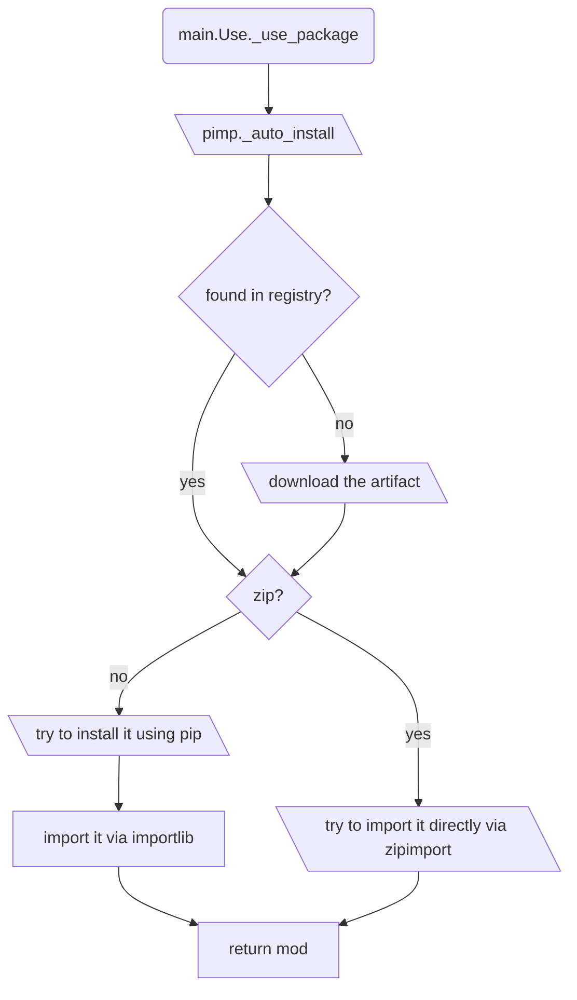

# Integration & Workflows

This document is the authoritative collection of all JustUse use cases, workflows, and integration patterns. It covers every supported import mode, configuration, and advanced usage scenario.

## 1. Supported Use Cases

### Local File Import
```python
mod = use(Path('local_module.py'))
```

### Package Import (with/without version)
```python
# Import installed package
np = use('numpy')
# Import with version pinning
np = use('numpy', version='1.21.0')
```

### Auto-Installation
```python
# Auto-install if not present
np = use('numpy', version='1.21.0', modes=auto_install)
```

### URL Import
```python
# Unsafe (testing only)
mod = use(URL('https://example.com/mod.py'))
# Hash-pinned (recommended)
mod = use(URL('https://example.com/mod.py'), hash_algo=Hash.SHA256, hash_value='abc...')
```

### Git Import
```python
mod = use(git('https://github.com/user/repo.git', subpath='src/mod.py', branch='main'))
```

### Tuple/Normalized Import
```python
# Tuple: (package_name, module_name)
mod = use(('py.foo', 'foo.bar'))
# Keyword: package_name/module_name
mod = use(package_name='py.foo', module_name='foo.bar')
```

### Initial Globals (for circular imports)
```python
mod = use(Path('mod.py'), globals_dict={'shared': obj})
```

### Aspect-Oriented Programming
```python
mod @ (callable, r'^api_.*', logging_decorator)
```

### Default Fallbacks
```python
mod = use('optional_package', default=SafeStub())
```

### Hot Reloading
```python
mod = use(Path('dev_module.py'), modes=reloading)
```

### Multi-Version Support
```python
np1 = use('numpy', version='1.21.0')
np2 = use('numpy', version='1.19.2')
```

### Lazy Import
```python
ml_tools = use.lazy('scikit-learn', condition=lambda: need_ml_features)
```

### Registry Operations
```python
use.registry.list_installations()
use.registry.cleanup_old_versions()
```

---

## 2. Workflows

### Modes of Operation



### Package Use & Normalization



### Auto-Installation Workflow



---

## 3. Advanced Patterns & Best Practices

### Environment Configurations

| Environment | Configuration | Use Case |
|-------------|---------------|----------|
| **Development** | `modes=reloading|auto_install, timeout=60` | Hot-reload, auto-install |
| **Production** | `modes=fastfail, require_hashes=True, auto_install=False` | Strict, secure |
| **CI/CD** | `modes=fastfail, timeout=5, auto_install=False` | Fast, reproducible |
| **Notebook** | `modes=reloading|auto_install` | Interactive, experimental |

### Collaborative Development
```python
shared_deps = {'numpy': '1.21.0', 'pandas': '1.5.0'}
for pkg, ver in shared_deps.items():
    globals()[pkg] = use(pkg, version=ver, modes=auto_install)
```

### Security-Conscious
```python
secure_pkg = use('cryptography', version='37.0.0', hash_algo=Hash.SHA256, hash_value='verified_hash', modes=fastfail)
```

---

## 4. Troubleshooting & Error Handling

| Problem | Solution | Example |
|---------|----------|---------|
| **Version Conflicts** | Use isolation | `with use.isolated_env(): v2_pkg = use('pkg', version='2.0')` |
| **Network Issues** | Configure retries/cache | `# not yet implemented: use(timeout=30, retry_count=3, cache_duration=3600)` |
| **Reload Failures** | Handle warnings | `warnings.showwarning = custom_handler` |
| **Performance Issues** | Registry maintenance | `use.registry.vacuum(); use.registry.cleanup_old_versions()` |

### Error Handling Patterns
```python
try:
    mod = use('package', modes=fastfail)
except VersionConflictError as e:
    print(f"Conflict: {e}")
    mod = use('package', default=SafeStub())

try:
    mod = use(URL('https://slow-server.com/mod.py'), timeout=5)
except TimeoutError:
    mod = use(Path('fallback/mod.py'))
```

---

## 5. Performance Optimization

### Caching Strategies

| Strategy | Implementation | Benefit |
|----------|----------------|---------|
| **Import Cache** | `@use.cached_import` | Avoid repeated downloads |
| **Lazy Loading** | `use.lazy('pkg', condition=lambda: needed)` | Defer until required |
| **Batch Import** | `with use.batch_import(): ...` | Single registry transaction |

### Registry Optimization
```python
use.registry.vacuum()                    # Optimize database
use.registry.cleanup_old_versions(3)     # Keep 3 versions
use.registry.rebuild_indexes()           # Rebuild for performance
stats = use.registry.performance_stats()
if stats.query_time > 100:  # ms
    use.registry.optimize()
```


## Auto-Installation Workflow
Inline-installation of packages is one of the most interesting and complex features of JustUse. With version and hash properly defined and auto-installation requested, the flow of action is as follows:



---
# Features & Capabilities

| Category | Features |
|----------|----------|
| **Core** | Unified import API (`use()`), inline version checking, hash pinning & verification (SHA256/BLAKE2s/JACK), auto-installation (PyPI, conda, C-extensions), multi-version support, hot auto-reloading, initial module globals, aspect-oriented programming (recursive decoration), default fallbacks, ProxyModule abstraction, registry & audit (SQLite), modes & flags (auto_install, fastfail, fatal_exceptions, no_browser, etc.), no-browser mode |
| **Security** | HTTPS enforcement, audit logging, configurable security levels, no public installation mode, hash verification, signature compatibility (planned), isolation (planned), module-level variable guards (planned) |
| **Configuration** | Layered config: env vars, config file, runtime flags, per-import options; testing & debugging support |
| **Error Handling** | Hierarchical error types, recovery strategies (fallbacks, isolated envs, registry rebuild, revert on reload failure), warning escalation |
| **Observability** | Usage metrics, immutable audit logs, compliance support |
| **Testing & Quality** | Comprehensive test suite (unit, integration, security, performance), CI/CD integration, mock infrastructure |
| **Planned/Advanced** | Plugin/slot architecture, visual dependency graph, P2P sourcing, on-site compilation (Cython), sub-interpreter isolation, signature verification, module-level guards |

---
