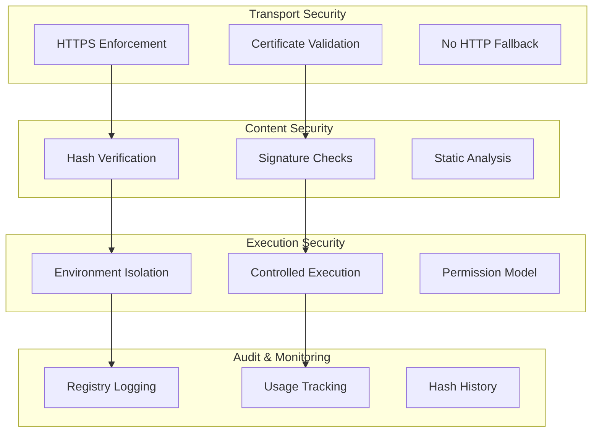
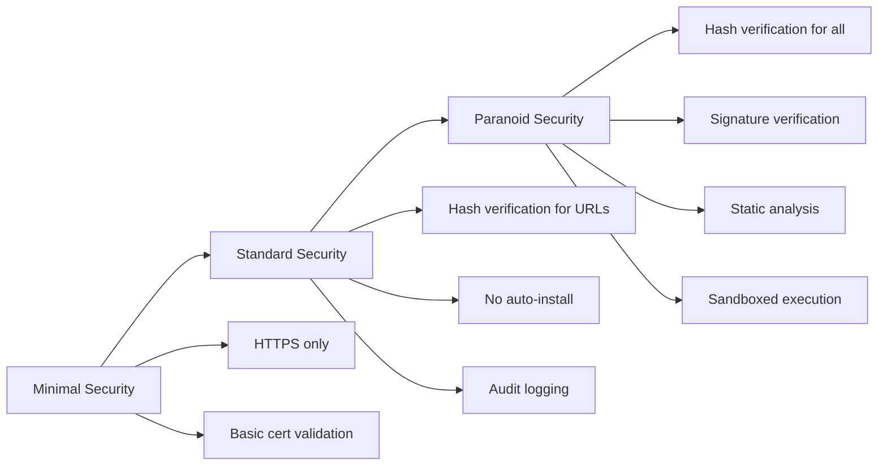

# Security

## 1. Security Model



## 2. Security Controls

| Layer | Control | Implementation | Risk Mitigated |
|-------|---------|----------------|----------------|
| **Transport** | HTTPS Only | Reject HTTP sources | Man-in-middle |
| **Content** | Hash Verification | SHA256/BLAKE2s mandatory for URLs | Content tampering |
| **Execution** | Environment Isolation | Virtual environments | Dependency conflicts |
| **Configuration** | No Browser Launch | `no_browser=True` default | Malicious redirects |

## 3. Hash Verification Matrix

| Source Type | Hash Required | Algorithm Options | Failure Action |
|-------------|---------------|-------------------|----------------|
| **URL** | ✅ Mandatory | SHA256, BLAKE2s, JACK | SecurityError |
| **Git** | ⚠️ Recommended | SHA256, BLAKE2s | Warning |
| **Path** | ❌ Optional | SHA256, BLAKE2s | ValidationError |
| **PyPI** | ⚠️ Recommended | SHA256 (from metadata) | Warning |

## 4. Threat Model

### High Priority Threats

| Threat | Impact | Mitigation | Status |
|--------|--------|------------|--------|
| **Malicious Code Injection** | High | Hash verification + HTTPS | ✅ Implemented |
| **Dependency Confusion** | Medium | Version pinning + registry | ✅ Implemented |
| **Man-in-Middle Attack** | High | Certificate validation | ✅ Implemented |
| **Local File Tampering** | Medium | Optional hash checking | ⚠️ Configurable |

### Security Configuration Levels



## 5. Audit Trail

| Event | Logged Data | Retention | Purpose |
|-------|-------------|-----------|---------|
| **Import** | `source, timestamp, hash, version` | 90 days | Compliance tracking |
| **Hash Mismatch** | `expected, actual, source, timestamp` | 1 year | Security incidents |
| **Version Conflict** | `requested, installed, timestamp` | 30 days | Dependency analysis |
| **Registry Access** | `operation, timestamp, user` | 30 days | Access monitoring |

### Security APIs

```python
# Security configuration
use.configure(
    require_hashes=True,      # Mandatory hash verification
    allow_http=False,         # HTTPS only
    verify_signatures=True,   # GPG signature checking
    audit_level='full'        # Complete audit trail
)

# Secure import patterns
secure_mod = use('package',
                version='1.0.0',
                hash_algo=use.Hash.SHA256,
                hash_value='verified_hash_here',
                require_signature=True)

# Security status check
security_status = use.security.audit()
if security_status.risk_level > 'medium':
    use.security.enforce_strict_mode()
```


# Features & Capabilities

| Category | Features |
|----------|----------|
| **Core** | Unified import API (`use()`), inline version checking, hash pinning & verification (SHA256/BLAKE2s/JACK), auto-installation (PyPI, conda, C-extensions), multi-version support, hot auto-reloading, initial module globals, aspect-oriented programming (recursive decoration), default fallbacks, ProxyModule abstraction, registry & audit (SQLite), modes & flags (auto_install, fastfail, fatal_exceptions, no_browser, etc.), no-browser mode |
| **Security** | HTTPS enforcement, audit logging, configurable security levels, no public installation mode, hash verification, signature compatibility (planned), isolation (planned), module-level variable guards (planned) |
| **Configuration** | Layered config: env vars, config file, runtime flags, per-import options; testing & debugging support |
| **Error Handling** | Hierarchical error types, recovery strategies (fallbacks, isolated envs, registry rebuild, revert on reload failure), warning escalation |
| **Observability** | Usage metrics, immutable audit logs, compliance support |
| **Testing & Quality** | Comprehensive test suite (unit, integration, security, performance), CI/CD integration, mock infrastructure |
| **Planned/Advanced** | Plugin/slot architecture, visual dependency graph, P2P sourcing, on-site compilation (Cython), sub-interpreter isolation, signature verification, module-level guards |

---
