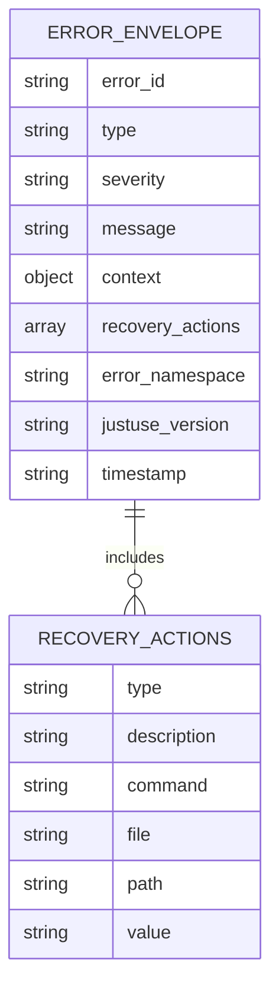
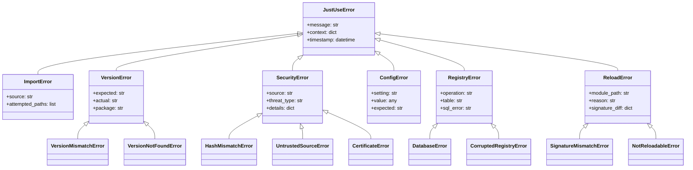

# Error Handling


## JSON Error Handling for Agents & LLMs

JustUse supports structured, agent-friendly error output for real-time debugging, CI, and LLM workflows. JSON diagnostics are emitted via a dedicated logger, and the logger's configuration determines the output destination (stdout, file, etc.).

- Errors are output as structured JSON envelopes via a dedicated logger (e.g., `justuse.json` logger). The logger's configuration determines the output destination (stdout, file, etc.).
- Human-readable diagnostics are sent to `stderr` (for developers).
- Output mode is auto-detected (env/config/TTY).


### Extensibility

> **Extensibility Note:**
> The JustUse error hierarchy is designed for easy extension. Users can subclass any error (e.g., `JustUseError`, `SecurityError`) to add custom fields, behaviors, or serialization logic. Custom error classes will automatically integrate with the JSON envelope and logger if they implement a `to_json()` or similar method.


> **Interoperability Note:**
> The JustUse JSON error envelope is designed to be compatible with [RFC 7807](https://datatracker.ietf.org/doc/html/rfc7807) (Problem Details for HTTP APIs), enabling maximum interoperability with agent frameworks, LLMs, and external systems.


### Error Code Registry

> **Error Code Reference:**
> All error codes (`error_id` fields, e.g., JU1000–JU5999) are formally documented in the JustUse error code registry:
> https://github.com/justuse-py/specs/error-codes.md


### Security & Privacy Note

> **Security/Privacy Note:**
> When including error context or recovery actions, always ensure that secrets, credentials, tokens, or sensitive file paths are not leaked in logs, JSON envelopes, or diagnostics. Sanitize or redact such information before output.

> **Schema Reference:**
> The formal JSON schema for JustUse errors is available at:
> https://github.com/justuse-py/specs/json-error-envelope.schema.json



> **Note:**
> - Complex errors and tracebacks are displayed interactively in the browser using Brython for a better debugging experience.
> - Aspect-oriented programming supports module-level wrapping and browser-based dry-run/decorator selection UIs.

## 1. Error Hierarchy



## 2. Error Handling Strategies

| Strategy | Mode | Behavior | Use Case |
|----------|------|----------|----------|
| **Graceful Degradation** | Default | Return stub, warn | Development, optional deps |
| **Fast Fail** | `fastfail=True` | Immediate exception | CI/CD, strict environments |
| **Retry with Backoff** | Network errors | Exponential backoff | Unreliable networks |
| **Fallback Sources** | Multi-source | Try alternatives | High availability |

## 3. Warning System

### Warning Categories

| Category | Trigger | Default Action | Configuration |
|----------|---------|----------------|---------------|
| `VersionWarning` | Version mismatch | Log warning | Can escalate to error |
| `SecurityWarning` | Security concerns | Log warning | Should escalate to error |
| `DeprecationWarning` | Deprecated features | Log warning | Future error |
| `NotReloadableWarning` | Reload failure | Log warning | Can ignore |
| `PerformanceWarning` | Slow operations | Log warning | Can ignore |

### Warning Configuration

```python
import warnings

# Convert security warnings to errors
warnings.filterwarnings('error', category=SecurityWarning)

# Ignore performance warnings
warnings.filterwarnings('ignore', category=PerformanceWarning)

# Custom warning handler
def custom_warning_handler(message, category, filename, lineno):
    if category == NotReloadableWarning:
        print(f"Reload failed: {message}")
        # Optionally restart or fallback

warnings.showwarning = custom_warning_handler
```

## 4. Recovery Mechanisms

### Automatic Recovery

| Error Type | Recovery Strategy | Implementation |
|------------|------------------|----------------|
| **Registry Corruption** | Rebuild from artifacts | `registry.recreate()` |
| **Network Timeout** | Retry with backoff | `retry_count=3, backoff=2^n` |
| **Module Reload Failure** | Revert to previous | Keep function backup |
| **Hash Mismatch** | Try alternative source | Fallback URL list |

### Recovery APIs

```python
# Registry recovery
try:
    use.registry.validate()
except CorruptedRegistryError:
    backup_path = use.registry.backup()
    use.registry.recreate()
    print(f"Registry rebuilt, backup at {backup_path}")

# Module recovery
mod = use(Path('changing_module.py'), modes=reloading)
if not mod._reload_status.success:
    print("Reload failed, manual restart required")
    mod._revert_to_previous()

# Network recovery with fallback
sources = [
    URL('https://primary.com/mod.py'),
    URL('https://backup.com/mod.py'),
    Path('local_fallback/mod.py')
]

for source in sources:
    try:
        mod = use(source, timeout=10)
        break
    except (TimeoutError, SecurityError):
        continue
else:
    raise ImportError("All sources failed")
```


## 5. Testing Patterns for Error Handling

### Error Output Testing

- Test that all error classes produce correct human-readable output (`str(e)`, `repr(e)`).
- Test that all error classes produce valid JSON envelopes (RFC 7807 compatible) via the logger or direct serialization.
- Test that error context and recovery actions are included in the JSON output.

### Recovery/Fallback Logic Testing

- Test that fallback and recovery strategies (e.g., retry, revert, alternative source) are triggered and logged as specified.
- Test that registry and module recovery APIs work as documented.

> **Tip:** Use parameterized tests to cover multiple error types and recovery scenarios. Consider snapshot testing for JSON error output.

### Debug Configuration

| Debug Level | Information | Performance Impact |
|-------------|-------------|-------------------|
| `ERROR` | Errors only | None |
| `WARNING` | Errors + warnings | Minimal |
| `INFO` | Basic operations | Low |
| `DEBUG` | Detailed tracing | Medium |
| `TRACE` | Full execution path | High |

### Diagnostic Tools

| Tool | Purpose | Example |
|------|---------|---------|
| `use.diagnose()` | System health check | `use.diagnose().report()` |
| `use.registry.inspect()` | Registry status | `use.registry.inspect().summary()` |
| `use.status(pkg)` | Package information | `use.status('numpy')` |
| `use.trace_import(pkg)` | Import path tracing | `use.trace_import('scipy')` |

### Error Context Enhancement

```python
# Enhanced error reporting
try:
    mod = use('package', version='1.0.0')
except use.VersionMismatchError as e:
    print(f"""
    Version Conflict:
      Package: {e.package}
      Expected: {e.expected}
      Found: {e.actual}
      Source: {e.source}
      Registry State: {e.context['registry_state']}
      Suggested Fix: {e.context['suggestion']}
    """)

# Debug context manager
with use.debug_context(level='TRACE'):
    mod = use('complex_package')
    # Detailed tracing logged
```


# Features & Capabilities

| Category | Features |
|----------|----------|
| **Core** | Unified import API (`use()`), inline version checking, hash pinning & verification (SHA256/BLAKE2s/JACK), auto-installation (PyPI, conda, C-extensions), multi-version support, hot auto-reloading, initial module globals, aspect-oriented programming (recursive decoration), default fallbacks, ProxyModule abstraction, registry & audit (SQLite), modes & flags (auto_install, fastfail, fatal_exceptions, no_browser, etc.), no-browser mode |
| **Security** | HTTPS enforcement, audit logging, configurable security levels, no public installation mode, hash verification, signature compatibility (planned), isolation (planned), module-level variable guards (planned) |
| **Configuration** | Layered config: env vars, config file, runtime flags, per-import options; testing & debugging support |
| **Error Handling** | Hierarchical error types, recovery strategies (fallbacks, isolated envs, registry rebuild, revert on reload failure), warning escalation |
| **Observability** | Usage metrics, immutable audit logs, compliance support |
| **Testing & Quality** | Comprehensive test suite (unit, integration, security, performance), CI/CD integration, mock infrastructure |
| **Planned/Advanced** | Plugin/slot architecture, visual dependency graph, P2P sourcing, on-site compilation (Cython), sub-interpreter isolation, signature verification, module-level guards |

---
