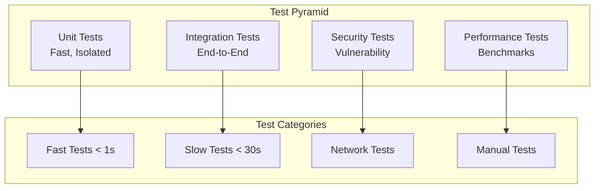

## Import Failure Behavior (IMPORTANT!)

If `justuse` cannot import the desired module, it now raises a structured exception (`JustUseError` or a subclass) that includes detailed context and a list of suggested recovery actions. This exception is always raised on failure, regardless of mode. The error object provides:

- A human-readable error message
- Structured context (including the attempted import, version, and environment)
- A list of `recovery_actions` (suggestions for how to resolve the failure)
- RFC 7807-compatible JSON serialization for agent/automation use

This approach ensures that failures are explicit and actionable, making it easier for both humans and automated systems to detect, handle, and recover from import problems. See the [Error Handling](spec-07-Error%20Handling.md) spec for more details and examples.

To catch and handle these exceptions in your code, use a try/except block:

```python
from justuse import use, JustUseError
try:
    mod = use("some_module", version="1.2.3")
except JustUseError as e:
    print("Import failed:", e)
    print("Recovery suggestions:", e.recovery_actions)
```

The previous behavior of returning `None` and printing JSON to stdout is no longer supported.

# Testing

## 1. Testing Strategy



## 2. Test Matrix

### Component Coverage

| Component | Unit Tests | Integration Tests | Security Tests | Performance Tests |
|-----------|------------|------------------|----------------|------------------|
| **use() dispatcher** | ✅ All argument types | ✅ End-to-end flows | ⚠️ Input validation | ✅ Dispatch speed |
| **Registry** | ✅ CRUD operations | ✅ Concurrent access | ❌ Not applicable | ✅ Query performance |
| **ProxyModule** | ✅ Attribute access | ✅ Reload cycles | ❌ Not applicable | ⚠️ Memory usage |
| **Hash verification** | ✅ All algorithms | ✅ Download verify | ✅ Malicious content | ⚠️ Hash speed |
| **ModuleReloader** | ✅ File watching | ✅ Signature checks | ❌ Not applicable | ✅ Reload timing |

### Test Environment Matrix

| Python Version | OS | Dependency Versions | Test Categories |
|---------------|----|--------------------|-----------------|
| 3.8, 3.9, 3.10, 3.11, 3.12 | Linux, Windows, macOS | Latest, LTS | Fast, Slow, Security |

## 3. Test Organization

```
tests/
├── unit/                 # Fast, isolated tests
│   ├── test_dispatcher.py    # use() argument routing
│   ├── test_registry.py      # Database operations
│   ├── test_proxy.py         # ProxyModule behavior
│   ├── test_reloader.py      # File watching
│   └── test_hashing.py       # Hash algorithms
├── integration/          # End-to-end workflows
│   ├── test_pypi.py          # PyPI package workflow
│   ├── test_url.py           # URL download workflow
│   ├── test_git.py           # Git repository workflow
│   └── test_reload.py        # Hot-reload workflow
├── security/             # Security validation
│   ├── test_hash_verify.py   # Hash verification
│   ├── test_malicious.py     # Malicious content
│   └── test_cert.py          # Certificate validation
└── performance/          # Benchmarks
    ├── test_import_speed.py  # Import timing
    ├── test_registry.py      # Database performance
    └── test_memory.py        # Memory usage
```

## 4. Test Infrastructure

### Mock Infrastructure

| Mock Component | Purpose | Implementation |
|----------------|---------|----------------|
| **PyPI Server** | Package downloads | `MockPyPIServer()` |
| **File System** | Local modules | `tmp_path` fixtures |
| **Network** | URL sources | `responses` library |
| **Registry** | Database isolation | `:memory:` SQLite |

```python
# Test fixtures
@pytest.fixture
def mock_pypi_server():
    with MockPyPIServer() as server:
        server.add_package('numpy', '1.21.0', content=b'...')
        yield server

@pytest.fixture
def temp_module(tmp_path):
    module = tmp_path / "test_module.py"
    module.write_text("def test_func(): return 42")
    return module

@pytest.fixture
def isolated_registry():
    with use.configure(registry=":memory:"):
        yield use.registry
```

## 5. Security Testing

### Security Test Categories

| Category | Tests | Purpose |
|----------|-------|---------|
| **Hash Verification** | Valid/invalid hashes, all algorithms | Prevent tampering |
| **Certificate Validation** | Valid/expired/self-signed certs | Prevent MITM |
| **Malicious Content** | Code injection, path traversal | Prevent exploitation |
| **Input Validation** | Malformed URLs, invalid params | Prevent crashes |

### Security Test Examples

```python
def test_hash_verification():
    """Test hash verification prevents tampered content"""
    content = b"malicious code"
    expected_hash = "abc123..."  # Hash of legitimate content

    with pytest.raises(HashMismatchError):
        use._verify_content(content, Hash.SHA256, expected_hash)

def test_certificate_validation():
    """Test SSL certificate validation"""
    with pytest.raises(CertificateError):
        use(URL('https://self-signed.badssl.com/module.py'))

def test_path_traversal_prevention():
    """Test path traversal attack prevention"""
    with pytest.raises(SecurityError):
        use(Path('../../../etc/passwd'))
```

## 6. Performance Testing

### Performance Benchmarks

| Benchmark | Target | Measurement |
|-----------|--------|-------------|
| **Import Speed** | < 100ms | Time to import package |
| **Registry Query** | < 10ms | Database query latency |
| **Hash Verification** | < 50ms | Hash calculation time |
| **Reload Cycle** | < 200ms | File change to reload |
| **Memory Usage** | < 50MB | Peak memory per module |

### Performance Test Framework

```python
@pytest.mark.benchmark
def test_import_speed(benchmark):
    """Benchmark package import speed"""
    result = benchmark(use, 'numpy', version='1.21.0')
    assert result is not None

@pytest.mark.performance
def test_memory_usage():
    """Test memory usage during module loading"""
    import psutil
    process = psutil.Process()

    before = process.memory_info().rss
    mod = use('large_package')
    after = process.memory_info().rss

    memory_increase = (after - before) / 1024 / 1024  # MB
    assert memory_increase < 50  # Less than 50MB
```

## 7. Continuous Integration

### CI Pipeline


### Test Execution Strategy

| Stage | Tests | Duration | Trigger |
|-------|-------|----------|---------|
| **Pre-commit** | Linting, fast units | < 30s | Every commit |
| **PR Validation** | All units, critical integration | < 5min | Pull request |
| **Nightly** | Full test suite | < 30min | Daily |
| **Release** | Full suite + manual | < 60min | Release tag |

### Test Configuration

```yaml
# pytest.ini
[tool:pytest]
markers =
    unit: Fast unit tests
    integration: Integration tests
    security: Security tests
    performance: Performance benchmarks
    slow: Tests that take > 1 second
    network: Tests requiring network access

# Run fast tests only
pytest -m "unit and not slow"

# Run security tests
pytest -m security

# Run with coverage
pytest --cov=justuse --cov-report=html
```


# Features & Capabilities

| Category | Features |
|----------|----------|
| **Core** | Unified import API (`use()`), inline version checking, hash pinning & verification (SHA256/BLAKE2s/JACK), auto-installation (PyPI, conda, C-extensions), multi-version support, hot auto-reloading, initial module globals, aspect-oriented programming (recursive decoration), default fallbacks, ProxyModule abstraction, registry & audit (SQLite), modes & flags (auto_install, fastfail, fatal_exceptions, no_browser, etc.), no-browser mode |
| **Security** | HTTPS enforcement, audit logging, configurable security levels, no public installation mode, hash verification, signature compatibility (planned), isolation (planned), module-level variable guards (planned) |
| **Configuration** | Layered config: env vars, config file, runtime flags, per-import options; testing & debugging support |
| **Error Handling** | Hierarchical error types, recovery strategies (fallbacks, isolated envs, registry rebuild, revert on reload failure), warning escalation |
| **Observability** | Usage metrics, immutable audit logs, compliance support |
| **Testing & Quality** | Comprehensive test suite (unit, integration, security, performance), CI/CD integration, mock infrastructure |
| **Planned/Advanced** | Plugin/slot architecture, visual dependency graph, P2P sourcing, on-site compilation (Cython), sub-interpreter isolation, signature verification, module-level guards |

---
