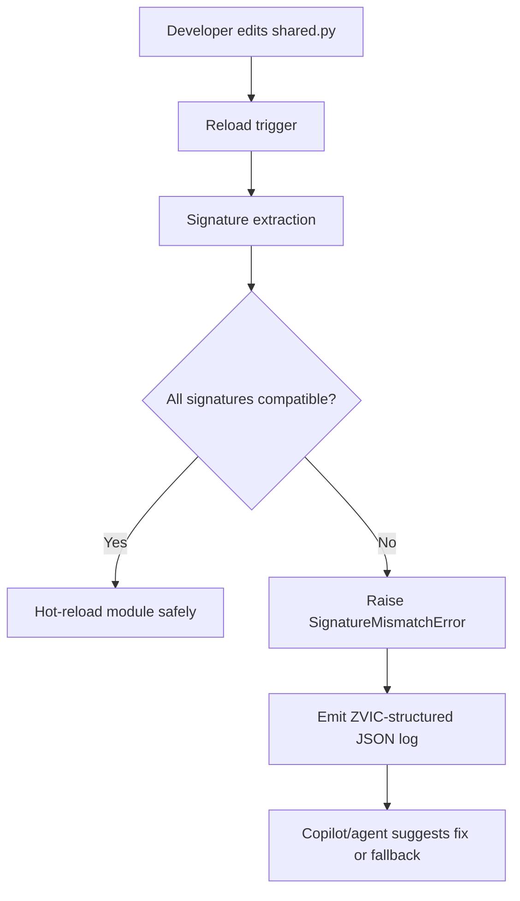
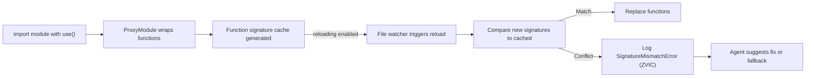
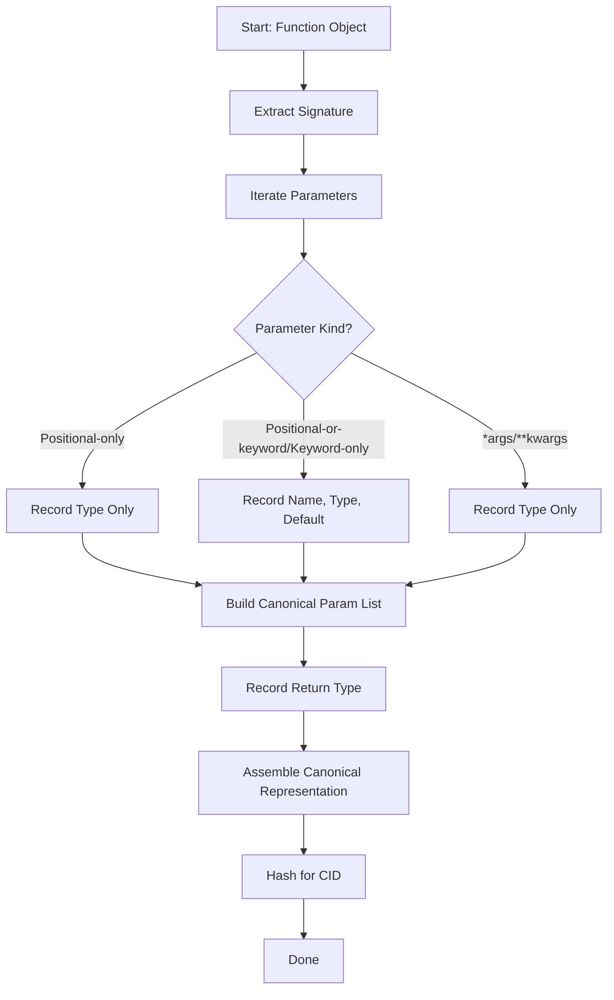
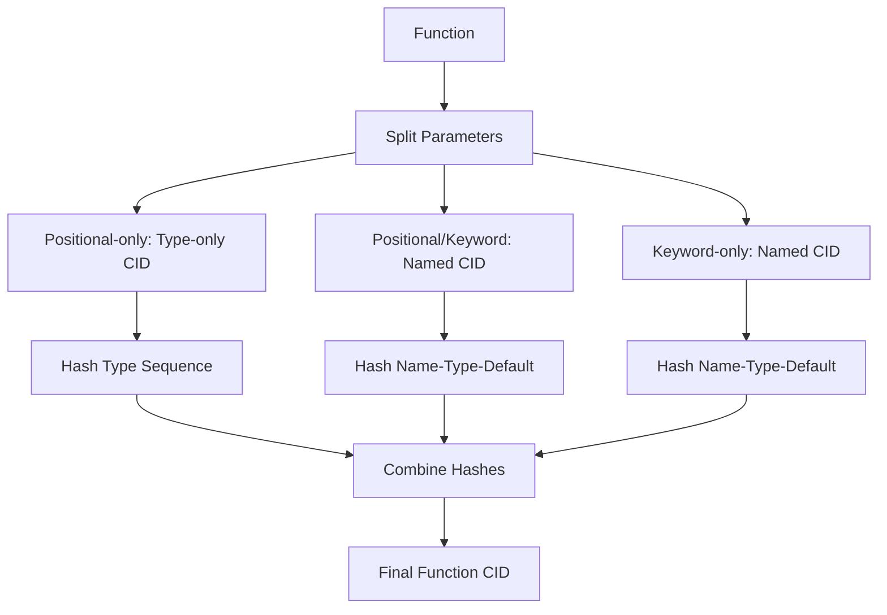
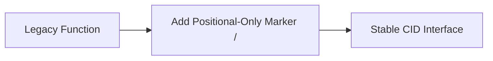

# Signature-Driven Functional Programming (SDFP) & Zero-Version Interface Contracts (ZVIC)

## Overview

JustUse introduces a modern runtime paradigm designed to optimize code reuse, compatibility, and reliability in distributed systems and microservices.

**SDFP (Signature-Driven Functional Programming)** and **ZVIC (Zero-Version Interface Contracts)** work together to ensure hot-reloadable, semantically-compatible modules through structure, not versioning.

---

## Signature-Driven Functional Programming (SDFP)

### Definition

> A runtime programming model where the behavior and lifecycle of functional code is governed by the structure of its function signatures, not external configuration or versions.

### Core Principles

* **First-class functions only**: modules should expose functions without internal state.
* **Signature-centric validation**: compatibility is enforced by comparing `inspect.signature()` results.
* **Hot reload enforcement**: modules can be reloaded safely if all signatures remain compatible.
* **Declarative, observable**: runtime code behavior is inspectable and predictable.

### Use Cases

* Shared logic across microservices
* Safe plugin/module reloads in dev & prod
* Real-time interface adaptation in agent-assisted systems

---

## Zero-Version Interface Contracts (ZVIC)

### Definition

> A strategy for managing code compatibility without version numbers, relying instead on runtime verification of callable structure.

### Core Principles

* **No semantic versioning required**
* **Interface stability through signature hashes**
* **Runtime fail-fast checks on API shape**
* **Inter-module contracts verified dynamically**

### Benefits

* No more dependency version drift
* Hashable, inspectable contracts
* Ideal for fast-moving, high-trust teams

---

## Architecture



---

## Example Error (ZVIC)

```jsonc
{
  "error_id": "JU3010",
  "type": "SignatureMismatchError",
  "error_namespace": "JUSTUSE_RELOADER",
  "message": "Function 'parse_order' signature changed incompatibly",
  "context": {
    "function": "parse_order",
    "old_signature": "parse_order(data: dict) -> Order",
    "new_signature": "parse_order(data: dict, *, flags: int = 0) -> Order"
  },
  "recovery_actions": [
    {
      "type": "manual_review",
      "description": "Check if new optional args are backwards compatible"
    }
  ],
  "justuse_version": "0.8.2",
  "timestamp": "2025-06-21T22:14:59Z"
}
```

---

## SDFP+ZVIC Lifecycle Flow



---

## ZVIC Contract Structure (per function)

```jsonc
{
  "function": "process_event",
  "signature": "process_event(evt: dict, *, timeout: int = 30) -> bool",
  "hash": "sha256:fd34...",
  "module": "shared.process"
}
```

---

## Summary

| Concept             | Description                                                               |
| ------------------- | ------------------------------------------------------------------------- |
| **SDFP**            | Treat functions as interface units, governed by their signature structure |
| **ZVIC**            | Runtime interface contract validation without version numbers             |
| **Hot Reloads**     | Allowed only if signature structure remains stable                        |
| **Dev/Prod Safety** | Fast iteration in dev, runtime guarantees in prod                         |

> With SDFP and ZVIC, JustUse redefines how dynamic Python modules can be safely reused, extended, and trusted — without the cognitive overhead of traditional versioning.


## Hybrid Canonicalization Strategy

| Parameter Kind           | Names Matter? | CID Determined By           | Compatible on Name Change? | Compatible on Type Change? | Compatible on Default Change? |
|-------------------------|:-------------:|-----------------------------|:--------------------------:|:--------------------------:|:-----------------------------:|
| Positional-only         | No            | Order + Types               | ✅ Yes                     | ❌ No                      | N/A                           |
| Positional-or-keyword   | Yes           | Names + Types + Defaults    | ❌ No                      | ❌ No                      | ❌ No                         |
| Keyword-only            | Yes           | Names + Types + Defaults    | ❌ No                      | ❌ No                      | ❌ No                         |
| *args                   | No            | Type                        | ✅ Yes                     | ❌ No                      | N/A                           |
| **kwargs                | No            | Type                        | ✅ Yes                     | ❌ No                      | N/A                           |

*Adding an optional positional-or-keyword parameter is compatible only if it has a default value.*

def canonical_signature(func) -> dict:

### Canonicalization Process Diagram



### Example Canonical Representations

| Function Definition | Canonical Representation |
|---------------------|-------------------------|
| `def process(a: int, b: int, /) -> float:` | `{ "name": "process", "params": [ {"kind": "POSITIONAL_ONLY", "type": "int"}, {"kind": "POSITIONAL_ONLY", "type": "int"} ], "return": "float" }` |
| `def transform(data: dict, verbose: bool = False) -> list:` | `{ "name": "transform", "params": [ {"kind": "POSITIONAL_OR_KEYWORD", "name": "data", "type": "dict"}, {"kind": "POSITIONAL_OR_KEYWORD", "name": "verbose", "type": "bool", "default": "False"} ], "return": "list" }` |
| `def render(*, width: int, height: int) -> Image:` | `{ "name": "render", "params": [ {"kind": "KEYWORD_ONLY", "name": "width", "type": "int"}, {"kind": "KEYWORD_ONLY", "name": "height", "type": "int"} ], "return": "Image" }` |

### Compatibility Matrix

| Change Type                | Positional-only | Positional-or-keyword | Keyword-only |
|----------------------------|:--------------:|:---------------------:|:------------:|
| Name change                | ✅ Yes         | ❌ No                 | ❌ No        |
| Type change                | ❌ No          | ❌ No                 | ❌ No        |
| Default value change       | N/A            | ❌ No                 | ❌ No        |
| Add optional param         | N/A            | ✅ Yes*               | ❌ No        |
| Add required param         | ❌ No          | ❌ No                 | ❌ No        |

*Only compatible if new parameter has a default value*

### CID Generation Workflow



### Implementation Advantages

- **Semantic Accuracy:** Matches Python's calling conventions (positional names ignored, keyword names matter)
- **Backward Compatibility:** Existing code works without changes
- **Gradual Strictness:** Opt-in to positional-only for CID stability
- **Error Prevention:** Clear diagnostics for incompatible changes
- **Migration Tooling:** e.g., `justuse migrate --positional-only my_module.py`
- **CID Policy Registry:** Per-project policy for positional/keyword handling

### Cross-language Consistency

| Language     | Positional-only | Keyword-equivalent |
|--------------|:---------------:|:------------------:|
| Python       | ✅              | ✅                 |
| Go           | ✅              | ❌                 |
| TypeScript   | ❌              | ✅                 |

### Upgrade Path Diagram



### Summary Table

| Benefit                | Description |
|------------------------|-------------|
| Stability              | Positional-only interfaces get stable CIDs across refactors |
| Flexibility            | Keyword interfaces maintain human-friendly semantics |
| Clear upgrade paths    | Migration and diagnostics are explicit |
| Enhanced diagnostics   | Clear error messages for signature changes |
| Backward compatibility | Existing code and interfaces remain valid |
