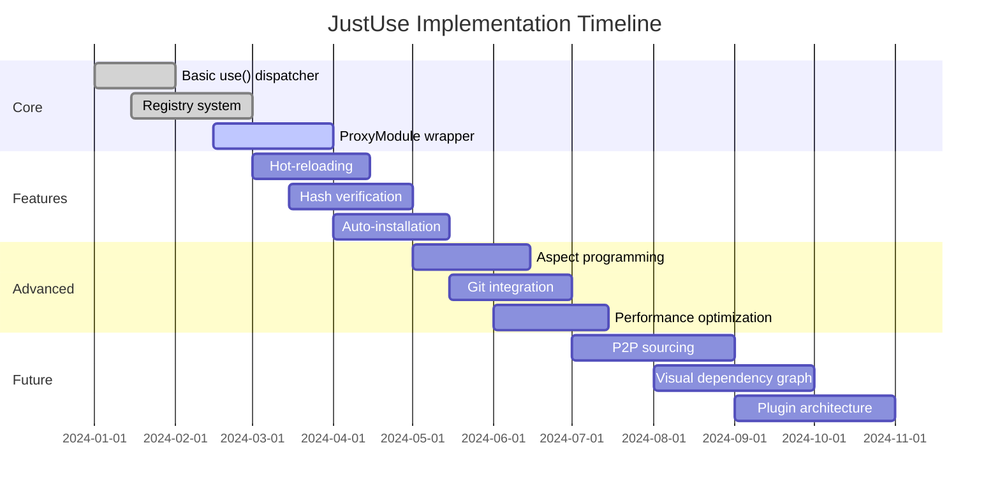

# Conclusion

## 1. Summary

JustUse provides a unified, secure, and flexible module import system for Python that addresses modern development needs through a single `use()` interface.

## 2. Key Benefits Matrix

| Benefit | Traditional Import | JustUse | Impact |
|---------|-------------------|---------|---------|
| **Multi-Source Support** | Local only | URL, Git, PyPI, Local | High flexibility |
| **Version Pinning** | Manual/requirements.txt | Inline specification | Reduced conflicts |
| **Hash Verification** | Not available | Built-in SHA256/BLAKE2s | Security guarantee |
| **Hot-Reloading** | Manual restart | Automatic file watching | Development speed |
| **Auto-Installation** | Separate pip command | Inline with import | Simplified workflow |
| **Usage Tracking** | Not available | SQLite registry | Audit compliance |

## 3. Architecture Strengths

| Component | Strength | Benefit |
|-----------|----------|---------|
| **Unified Interface** | Single entry point | Reduced cognitive load |
| **Registry System** | Persistent metadata | Usage analytics, cleanup |
| **ProxyModule** | Transparent wrapper | Advanced features without API changes |
| **buffet_table** | Centralized policy | Consistent decision logic |
| **Security Model** | Multi-layered protection | Defense in depth |

## 4. Implementation Roadmap

## 5. Future Work & Extensions

### Near-Term (6 months)

| Feature | Priority | Complexity | Impact |
|---------|----------|------------|--------|
| **GitHub ZIP installs** | High | Medium | Expand source options |
| **Signature verification** | High | High | Enhanced security |
| **Performance optimization** | Medium | Medium | Better user experience |
| **Visual dependency graph** | Low | High | Development tool |

### Long-Term (12+ months)

| Feature | Priority | Complexity | Impact |
|---------|----------|------------|--------|
| **P2P package sourcing** | Medium | Very High | Decentralization |
| **Cross-interpreter isolation** | Low | Very High | Advanced isolation |
| **Plugin architecture** | Medium | High | Extensibility |
| **Enterprise features** | Medium | Medium | Commercial adoption |

## 6. Success Metrics

### Adoption Metrics

| Metric | Target | Measurement |
|--------|--------|-------------|
| **GitHub Stars** | 1000+ | Community interest |
| **PyPI Downloads** | 10k/month | Actual usage |
| **Documentation Views** | 5k/month | User engagement |
| **Contributors** | 20+ | Community health |

### Technical Metrics

| Metric | Target | Current | Goal |
|--------|--------|---------|------|
| **Test Coverage** | 95%+ | TBD | Quality assurance |
| **Performance** | < 100ms import | TBD | User experience |
| **Security Score** | A+ | TBD | Trust & adoption |
| **Documentation** | 100% API coverage | TBD | Developer experience |

## 7. Implementation Guidelines

### Development Priorities

1. **Core functionality first**: Reliable `use()` dispatcher and registry
2. **Security by design**: Hash verification and HTTPS enforcement
3. **Performance optimization**: Minimize overhead and latency
4. **Comprehensive testing**: High coverage across all components
5. **Clear documentation**: Easy adoption and contribution

### Quality Gates

| Gate | Criteria | Enforced By |
|------|----------|-------------|
| **Code Quality** | Pylint score > 9.0 | Pre-commit hooks |
| **Test Coverage** | Coverage > 95% | CI pipeline |
| **Security** | No high/critical vulns | Security scanning |
| **Performance** | Benchmarks pass | Performance tests |
| **Documentation** | All APIs documented | Doc generation |

---

**JustUse represents a significant evolution in Python module management, providing the security, flexibility, and developer experience needed for modern Python development.**

# Features & Capabilities

| Category | Features |
|----------|----------|
| **Core** | Unified import API (`use()`), inline version checking, hash pinning & verification (SHA256/BLAKE2s/JACK), auto-installation (PyPI, conda, C-extensions), multi-version support, hot auto-reloading, initial module globals, aspect-oriented programming (recursive decoration), default fallbacks, ProxyModule abstraction, registry & audit (SQLite), modes & flags (auto_install, fastfail, fatal_exceptions, no_browser, etc.), no-browser mode |
| **Security** | HTTPS enforcement, audit logging, configurable security levels, no public installation mode, hash verification, signature compatibility (planned), isolation (planned), module-level variable guards (planned) |
| **Configuration** | Layered config: env vars, config file, runtime flags, per-import options; testing & debugging support |
| **Error Handling** | Hierarchical error types, recovery strategies (fallbacks, isolated envs, registry rebuild, revert on reload failure), warning escalation |
| **Observability** | Usage metrics, immutable audit logs, compliance support |
| **Testing & Quality** | Comprehensive test suite (unit, integration, security, performance), CI/CD integration, mock infrastructure |
| **Planned/Advanced** | Plugin/slot architecture, visual dependency graph, P2P sourcing, on-site compilation (Cython), sub-interpreter isolation, signature verification, module-level guards |

---
